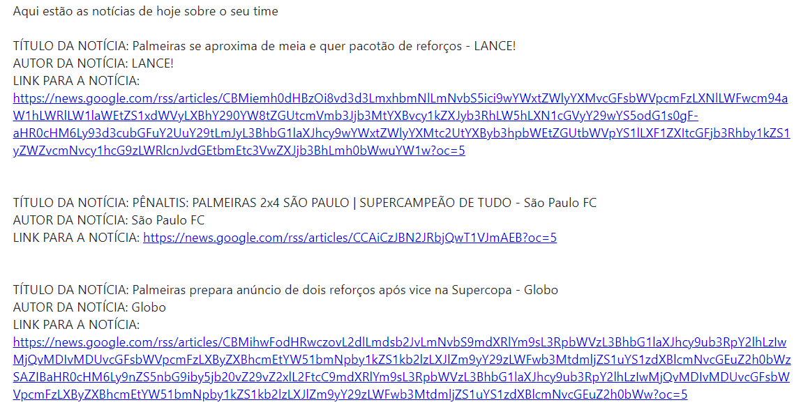

# Sobre o projeto

A ideia principal desse projeto é uma API que faz o envio de notícias diárias de times de futebol para usuários cadastrados. 
Os usuários recebem as notícias através de seu e-mail todos os dias às 18:30h.

Para se cadastrar, o usuário deve fornecer as seguintes informações: **e-mail** e **time**.

### Tecnologias / Ferramentas
- Java
- Docker
- Spring Boot
- Spring Mail Sender
- Spring JPA
- MySQL

### Como funciona?

**Na teoria:** Usando a classe **RestTemplate**, o Java consome a API do Google (https://newsapi.org) que fornece diversas informações, inclusive sobre notícias de futebol.
Todo dia às 18:30, graças à annotation *@Scheduled* na classe **EmailSenderService**, o método **enviarEmail()** é executado
fazendo a leitura dos e-mails cadastrados no banco de dados e finalmente realizando o envio de e-mail.

**Na prática:** É usado todos os recursos apresentados acima, exceto a annotation **@Scheduled**, fazendo com que ao
cadastrar um usuário, automaticamente o e-mail já é enviado. Isso se dá pelo motivo de que, como o projeto não está 
deployado, seria necessário deixar rodando o projeto até o relógio marcar 18:30h.

# Configurações necessárias
**1.** É necessário que você siga [esse passo a passo](https://support.google.com/accounts/answer/185833) para que obter uma "Senha de app" do Google e adicioná-la às configurações 
SMTP do GMAIL no arquivo application.properties.

**2.** Também é necessário que você se cadastre [nesse site](https://newsapi.org/) para ter uma API Key e conseguir usar
a News API. Após obter a key, adicione-a no "api.url" no arquivo application.properties.

# Como executar
- 1º Certifique-se que as configurações acima estão implementadas
- 2º Dentro da pasta do projeto, use o comando "docker-compose up". Isso já será o bastante para dockerizar o banco de dados MySQL e a aplicação Spring Boot.
- 3º No Postman (ou qualquer outra ferramenta similar), faça uma requisição POST para o endereço "http://localhost:8080/api/v1" enviando no corpo JSON os campos "e-mail" e "time".

# Exemplo do e-mail recebido

### 👇👇 Nesse formato será o e-mail recebido pelo usuário cadastrado. Nesse exemplo o usuário se cadastrou usando como time o "Palmeiras". 👇👇

